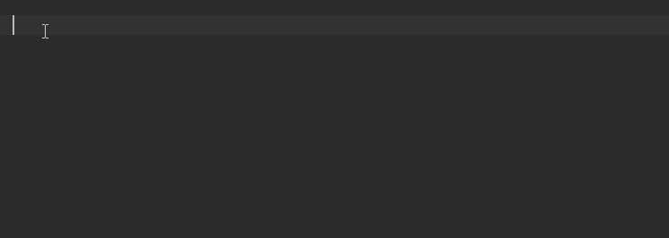

# sqlhelper

## 一、介绍

**sql助手，这是一款用于快速编写生成sql的工具，生成的sql可以用于各种ORM框架如Mybatis、Spring JDBC等，对于Spring JDBC我们已经有了一个集成项目sqlhelper-spring，本文只介绍sqlhelper用法，如对sqlhelper-spring有兴趣可以点击下方链接**

[sqlhelper-spring](https://github.com/83945105/sqlhelper-spring )


## 二、理念

**首先本项目并不是一个ORM框架，我们不提供任何ORM框架功能，因为市面上已经有很多成熟的ORM框架，我们没必要去重复造轮子，我们只为了解决编写、维护sql语句这一个痛点，因此这只是一个单纯用于生产sql语句的工具。你可以将生产出的sql语句用于各种ORM框架。我们秉承着使用简单，零配置，所见即所得的思想进行开发。实际上，对于像Hibernate、MyBatis之类的框架也提供了相关编写sql语句的方式，如在实体Bean中加入注解，使用xml编写之类的方式，但这些方式无一例外都有一些痛点，我们会在下文详细说明这些问题。本工具并不是万能的，我们的目标是解决掉一个项目中80%-90%的sql，对于一些复杂的sql如统计sql，我们不对其进行支持，当然这并不是因为实现不了，而是对于过于复杂的sql，使用本工具提供的方式反而会适得其反，我们永远遵循着所见即所得，简单明了，一目了然的思想，当你看完本文档应该能够明白。**


## 三、特色

-  纯Java代码，无需任何文件配合。纯天然，无污染。
-  无任何注解。注解把代码逻辑分散的到处都是，好烦有木有，维护好痛苦。
-  多数据库支持，可以一键切换sql语句生成方式，生成支持对应数据库语法的sql，不用担心换库问题。
-  无需手动填入列名、字段名 ，再也不用担心写sql的过程中忘记表中有哪些字段。。。字段名叫啥了。。。也不用担心手抖写错了。。。
-  支持多表连接操作、支持子查询、支持批量语句。
-  结构清晰，所见即所得，熟悉本工具之后，一眼望过去，你就知道你写的这段代码对应的sql是什么样子。后续维护加个条件啥的易如反掌。
-  动态适配字段，啥？表加字段？删字段？改字段名？这都不是问题，本工具可以轻松解决这些开发中常见问题。
-  支持动态表名，支持动态表之间连接操作。分表啥的不是问题。
-  支持重写相关方法实现自定义产出sql格式，如果你感觉我们生产的sql写的太low。。。你可以以重写相关类的方式实现你自己的逻辑。
-  更多特色待添加


## 四、数据库支持

*目前仅支持MySql、SqlServer,更多数据库支持会陆续添加*


## 五、文档

> <a name="doc">目录</a>
>
> 1. <a href="#doc1">准备工作</a>
> 2. <a href="#doc2">第一个demo，主键查询</a>
> 3. <a href="#doc3">指定查询列</a>
> 4. <a href="#doc4">条件查询</a>
> 5. <a href="#doc5">复杂的条件查询</a>
> 6. <a href="#doc6">连接查询</a>

**<a name="doc1" href="#doc">1、准备工作</a>**

使用本工具前，先确保你的jdk版本不低于8，然后你需要先使用本工具提供的模板工具为每一张数据库表生成一个模型类，MySql示例代码如下：

```
        JdbcSourceEngine engine = JdbcSourceEngine.newMySqlEngine(
                "com.mysql.jdbc.Driver",
                "jdbc:mysql://localhost:3306/数据库名?useSSL=false",
                "账号", "密码");
		//构建模板引擎,设置映射方式为驼峰转换(目前唯一支持)
        new ModelTemplateEngine(engine, new HumpConverter())
        		//设置模板后缀名,默认Model
        		.setTemplateSuffix("Model")
        		//添加要生成的表名和对应生成的类名
                .addTable("表名", "类名")
                .addTable("sys_user", "SysUser")
				//开始处理,第一个参数为项目路径,第二个参数为包路径
                .process("/", "pub.avalon.sys.model");         
```

注：模板实现使用了thymeleaf，如果你使用了spring boot，可能会和spring boot内置的spring-boot-start-thymeleaf包冲突，如果你不善于解决maven依赖冲突，你可以为生成模型类的这段代码单独创建一个项目，每次生成完模型类后手动copy至开发项目中。

**<a name="doc2" href="#doc">2、第一个demo，主键查询</a>**

有了模型类后，我们就可以开始愉快的写代码了，我们先来个简单的MySql主键查询示例。

```
        //使用MySql动态引擎查询SysUserModel对应的表
        SqlBuilder sqlBuilder = MySqlDynamicEngine.query(SysUserModel.class)
                //调用主键查询接口
                .queryByPrimaryKey("主键ID");
        //产出预编译sql
        String sql = sqlBuilder.getPreparedStatementSql();
        //产出预编译sql参数
        List<Object> args = sqlBuilder.getPreparedStatementArgs();
        //TODO 你可以将产出的预编译sql和参数传入如Spring JDBC的JdbcTemplate相关方法中使用
        //TODO 或者可以使用我们集成好的项目 sqlhelper-spring 该项目提供了很多强大的通用增删改查接口
```

产出的sql如下：

```
select
	SysUser.`id` `id`,
	SysUser.`user_name` `userName`,
	SysUser.`login_name` `loginName`
from
	sys_user SysUser 
where
	SysUser.`ID` = ?
```

可以看到，生成的sql语句默认遵循了驼峰转换规则，同时我们查询了表中所有的字段，但是在实际开发中，我们可能只需要查询指定的字段，这种情况我们就得指定查询列，比如我们只需要查询出id、user_name列。

**<a name="doc3" href="#doc">3、指定查询列</a>**

```
        SqlBuilder sqlBuilder = MySqlDynamicEngine.query(SysUserModel.class)
                //指定查询表的id、userName字段并给userName字段取个别名userNameAlias
                .column(table -> table.id().userName("userNameAlias"))
                .queryByPrimaryKey("主键ID");
```

产出的sql如下：

```
select
	SysUser.`id` `id`,
	SysUser.`user_name` `userNameAlias` 
from
	sys_user SysUser 
where
	SysUser.`id` = ?
```

这样就可以仅查询指定列，同时展示了如何给列取别名，如果不取别名默认驼峰转换。

**<a name="doc4" href="#doc">4、条件查询</a>**

**基本条件**

部分条件都有一个参数ComparisonRule，表示比较规则。

|      方法名      |    sql运算符    |           方法名           | sql运算符  |
| :--------------: | :-------------: | :------------------------: | :--------: |
|      isNull      |     = null      |         isNotNull          |  != null   |
|   equalToValue   |       = ?       |      notEqualToValue       |    != ?    |
| greaterThanValue |       > ?       | greaterThanAndEqualToValue |    >= ?    |
|  lessThanValue   |       < ?       |  lessThanAndEqualToValue   |    <= ?    |
|   betweenValue   | between ? and ? |         likeValue          |   like ?   |
|     inValue      |     in (?)      |         notInValue         | not in (?) |

**其它条件**

这些条件默认指定了ComparisonRule规则为NULL_SKIP，表示如果传入的参数为null则该条件不会被生成sql

|   方法名    |    sql运算符    |        方法名         | sql运算符  |
| :---------: | :-------------: | :-------------------: | :--------: |
|   equalTo   |       = ?       |      notEqualTo       |    != ?    |
| greaterThan |       > ?       | greaterThanAndEqualTo |    >= ?    |
|  lessThan   |       < ?       |  lessThanAndEqualTo   |    <= ?    |
|   between   | between ? and ? |         like          |   like ?   |
|     in      |     in (?)      |         notIn         | not in (?) |

**特殊条件**

由于java语法原因，对于集合的操作，无法准确识别集合内元素类型，因此有了如下条件

| 方法名 |            说明            | 方法名 |            说明            |
| :----: | :------------------------: | :----: | :------------------------: |
|  inS   |   参数为String类型的集合   | notInS |   参数为String类型的集合   |
|  inI   |  参数为Integer类型的集合   | notInI |  参数为Integer类型的集合   |
|  inL   |    参数为Long类型的集合    | notInL |    参数为Long类型的集合    |
|  inD   |   参数为Double类型的集合   | notInD |   参数为Double类型的集合   |
|  inB   | 参数为BigDecimal类型的集合 | notInB | 参数为BigDecimal类型的集合 |


有时候我们需要将表的其它字段作为条件进行查询，先来个MySql的例子。

```
        SqlBuilder sqlBuilder = MySqlDynamicEngine.query(SysUserModel.class)
                .column(table -> table.id().userName("userNameAlias"))
                //使用where条件,你将有俩个参数可用。
                //condition - 条件，第一次可以调出and条件，之后可以调出or条件
                //mainTable - 主表,也就是你操作的出发表，这里为对应SysUserModel对应的表
                .where((condition, mainTable) -> condition
                        //添加一个and条件，条件为当主表的userName字段模糊匹配“白”开头的字符
                        .and(mainTable.userName().like("白%")))
                //查询，注意这里就用不了queryByPrimaryKey方法了
                .query();
```

产出的sql如下：

```
select
	SysUser.`id` `id`,
	SysUser.`user_name` `userNameAlias` 
from
	sys_user SysUser 
where
	SysUser.`user_name` like ?
```

看到这里，可能有人会问代码中的 `->`是什么，这个是从java8开始支持的lambda语法，如果你对lambda语法不熟悉，建议先去了解下lambda再开始阅读下文，接下来的例子将大量使用lambda语法，这也是为什么本工具要求的jdk版本不能低于8的原因，至于为什么设计成lambda风格，因为使用lambda可以让代码结构看起来比较像sql语句的格式，这与我们理念中的所见即所得的思想比较符合，实际上，如果你使用了如IntelliJ IDEA之类的编辑器，lambda写起来是十分迅速的。无需每一行代码都定义对象接收返回值，这样使用本工具写sql将十分迅速流畅。



**上面的例子只是一个条件，那么多条件查询该如何写呢**

**and条件**

```
        SqlBuilder sqlBuilder = MySqlDynamicEngine.query(SysUserModel.class)
                .column(table -> table.id().userName("userNameAlias"))
                .where((condition, mainTable) -> condition
                        //添加一个and条件 userName 等于 1
                        .and(mainTable.userName().equalTo("1")
                                //继续追加一个and条件 loginName 等于2
                                .loginName().equalTo("2")))
                .query();
                
        //你也可以这么写
        SqlBuilder sqlBuilder = MySqlDynamicEngine.query(SysUserModel.class)
        		.column(table -> table.id().userName("userNameAlias"))
        		.where((condition, mainTable) -> condition
        				//添加一个and条件 userName 等于 1
        				.and(mainTable.userName().equalTo("1"))
        						//继续追加一个and条件 loginName 等于2
        						.and(mainTable.loginName().equalTo("2")))
        		.query();
```

产出的sql：

```
select
	SysUser.`id` `id`,
	SysUser.`user_name` `userNameAlias` 
from
	sys_user SysUser 
where
	SysUser.`user_name` = ? 
	and SysUser.`login_name` = ?
```

**or条件**

```
        SqlBuilder sqlBuilder = MySqlDynamicEngine.query(SysUserModel.class)
                .column(table -> table.id().userName("userNameAlias"))
                .where((condition, mainTable) -> condition
                        //添加一个and条件 userName 等于 1
                        .and(mainTable.userName().equalTo("1"))
                        //继续追加一个or条件 loginName 等于2
                        .or(mainTable.loginName().equalTo("2")))
                .query();
```

产出的sql：

```
select
	SysUser.`id` `id`,
	SysUser.`user_name` `userNameAlias` 
from
	sys_user SysUser 
where
	SysUser.`user_name` = ? 
	or SysUser.`login_name` = ?
```

**<a name="doc5" href="#doc">5、复杂的条件查询</a>**

在sql语句中，and和or条件是可以互相嵌套的，对于这一点工具也是支持的。

```
        SqlBuilder sqlBuilder = MySqlDynamicEngine.query(SysUserModel.class)
                .column(table -> table.id().userName("userNameAlias"))
                .where((condition, mainTable) -> condition
                        // and条件继续使用lambda获取新的condition取名为cd(防止重名)、新的mainTable取名为mt
                        // 同样or条件也支持, 这里就不举例了
                        .and((cd, mt) -> cd
                                .and(mt.userName().like("1"))
                                .or(mt.loginName().like("2")))
                        .and(mainTable.userName().equalTo("3")))
                .query();
```

产出的sql：

```
select
	SysUser.`id` `id`,
	SysUser.`user_name` `userNameAlias` 
from
	sys_user SysUser 
where
	( SysUser.`user_name` like ? or SysUser.`login_name` like ? ) 
	and SysUser.`user_name` = ?
```

这样就实现了条件嵌套，功能上支持无限嵌套。

**<a name="doc6" href="#doc">6、连接查询</a>**

本工具不仅仅支持单表操作,同样也支持多表连接操作，下面举个非常常见的内连接查询例子：

```
        SqlBuilder sqlBuilder = MySqlDynamicEngine.query(SysUserModel.class)
                // 连接UserRoleModel对应的表 , 设置连接类型为inner , 或者直接使用innerJoin可以省略该参数
                .join(UserRoleModel.class, JoinType.INNER, (on, joinTable, mainTable) -> on
                        // 从lambda函数获取参数 on - on条件、joinTable - 当前连接表(UserRoleModel对应的表)、mainTable - 主表(SysUserModel对应的表)
                        // 表示内连接user_role表,连接条件是user_role表的user_id字段等于主表的id字段
                        .and(joinTable.userId().equalTo(mainTable.id())))
                // 使用innerJoin可以省略连接类型参数
                //.innerJoin(UserRoleModel.class, (on, joinTable, mainTable) -> on
                //        .and(joinTable.userId().equalTo(mainTable.id())))
                .column(table -> table.id().userName("userNameAlias"))
                .where((condition, mainTable) -> condition
                        .and(mainTable.userName().like("")))
                .query();
```

产出的sql：

```
select
	SysUser.`id` `id`,
	SysUser.`user_name` `userNameAlias` 
from
	sys_user SysUser
	inner join user_role UserRole on UserRole.`user_id` = SysUser.`id` 
where
	SysUser.`user_name` like ?
```

